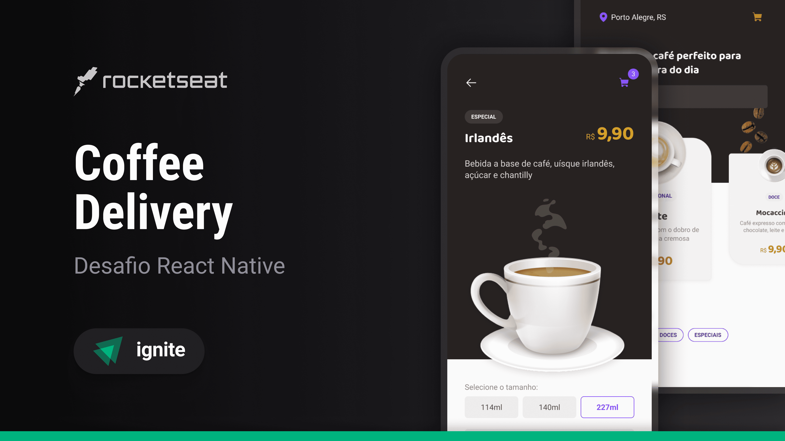

[](https://youtu.be/xi5xTBax3Xg)

<iframe width="560" height="315"
src="https://youtu.be/xi5xTBax3Xg)"
frameborder="0"
allow="accelerometer; autoplay; encrypted-media; gyroscope; picture-in-picture"
allowfullscreen></iframe>

## Sobre o projeto

## Features

## Pré-requisitos

Antes de começar, você vai precisar ter instalado em sua máquina as seguintes ferramentas:
[Git](https://git-scm.com), [Node.js e npm](https://nodejs.org/en/).

Além disto é bom ter um editor para trabalhar com o código como [VSCode](https://code.visualstudio.com/), e um emulador ou aparelho com o Expo Go instalado.

### Executando o aplicativo

```bash
# Clone este repositório
$ git clone https://github.com/gustavosorati/coffee-delivery

# Vá para a pasta server
$ npm install

# Instale as dependências
$ npx expo start
```


